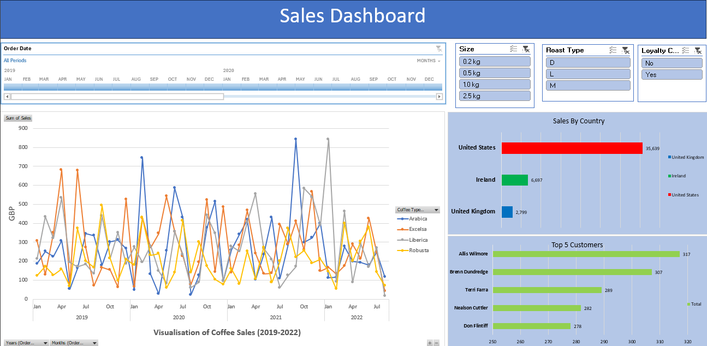

# Data-Analysis-with-Excel

This repository contains a few of my Excel projects.

## Coffee Company Sales Dashboard

This project features a dynamic, interactive sales dashboard created in Excel to model the sales performance of a fictional coffee company. The dashboard provides a comprehensive view of key sales metrics, allowing users to explore data across various dimensions and time periods.

### Key Features:
- **Data Modeling:** The underlying data is modeled to allow for detailed analysis, including comparisons across products, regions, and sales periods.
- **Interactive Visuals:** The dashboard includes interactive charts and graphs that update based on user selections, providing insights into sales trends, product performance, and regional distribution.
- **Advanced Excel Functions:** Utilized powerful Excel functions such as **Pivot tables**, **XLOOKUP**, and dynamic arrays to create a responsive and user-friendly interface.

The dashboard serves as an example of how Excel's advanced features can be leveraged to create effective data visualizations and analysis tools for business use.
